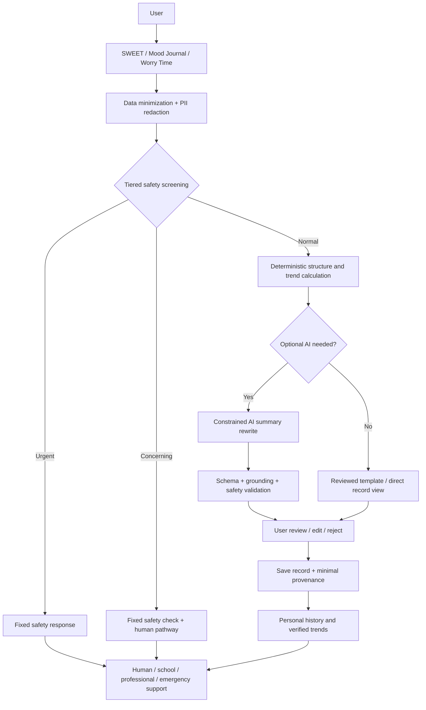

# YouthTempo AI Scope & Safety Audit

审查日期：2026-08-18
审查目标：判断 YouthTempo 能否取消用户与 AI 的自由对话，只保留受限的后台记录整理能力
审查范围：frontend、backend、API routes、AI/system prompts、数据库函数、环境变量、供应商集成、Talk/Chat/Support/Journal/SWEET/Check-in 相关流程
代码修改：无
最终建议：**REDUCE AI SCOPE，并把 REMOVE DIRECT AI CHAT 作为正式产品边界**

> 本报告是产品与技术范围审查，不是医疗或法律意见。生产环境变量、供应商账户设置、学校流程和外部签字不在仓库中，不能从代码推定已经完成。

## 审查后实施状态（2026-08-18）

下文保留的是修改前的审查证据和风险判断。审查后已按建议完成首轮技术收敛：Worry Time 与 Referral 均改为版本化固定规则；Check-in 与 Mood Journal 的模型输出进一步收敛为来源字段 ID 选择，服务器严格校验后以脱敏来源片段和固定模板组成小结；普通生成绑定服务端登录与有效同意，并增加扩展标识移除、生成总开关、provider 主机与模型白名单；“我觉得活着没有意义”及对应中英文被动轻生表达已进入模型调用前的确定性安全路径。公开文案统一优先连接家长、老师或其他可信任成年人，英文紧急提示只使用当地紧急服务。

当前仍不能标记为无条件 `READY`：代码级严格来源选择、模型 allowlist 和总开关已经实现；日期快照、正式环境配置证据、provider 治理、生成记录 provenance 及外部签字作为后续条件继续完成。首批受控试点结论保持 **READY WITH CONDITIONS**。

## 0. 最重要问题的直接答案

### 现在到底有没有 AI 直接对话功能？

需要分两层回答：

1. **自由、多轮、可持续的 AI chatbot：NO。**
   - 青少年端“陪我捋一捋”Talk 页面当前没有输入框。
   - `/api/ai/talk` 的普通请求返回版本化 `410`，不调用模型。
   - 旧客户端提交的最近最多 16 条消息只用于本地危机规则扫描；只有明确风险命中时返回固定安全提示。
   - 不保存聊天记录。

2. **用户提交内容后直接看到生成式 AI 回应：YES。**
   - SWEET Check-in、Mood Journal、Worry Time 仍调用真实的 OpenAI-compatible API 集成。
   - 它们不是多轮聊天，但模型结果会直接显示给用户。
   - 当前输出不仅是“摘要”：还包括小行动、沟通建议、睡前自我提醒、支持提醒和下一工具推荐。

因此，YouthTempo **已经在运行层面关闭了真正的 chatbot，但尚未完全收敛为纯后台总结层**。

### 删除 AI 直接对话会不会破坏核心产品？

**不会。答案是 YES，可以安全删除。**

- Talk 已经关闭，核心导航和首轮试点不依赖它。
- SWEET 的核心是五维记录、保存、历史和变化观察，不依赖聊天。
- Mood Journal 的核心是情绪命名、情境记录、表达准备，不依赖聊天。
- Worry Time 的核心是写下担心、区分可控/不可控、确定明日小步骤，可由规则和模板完成。
- Referral 已经完全去 AI 化。
- Parent、School、Messages、Community、Consent、RLS 和管理流程都不依赖 chatbot。

小程序当前把“生成 AI 小结并保存”串在同一个按钮流程中，因此将来移除生成调用时需要小范围实现调整；这属于交互流程修改，不是核心产品架构依赖。

## 1. Current AI Inventory

### 1.1 A 类：自由 AI 对话／Chatbot

| 功能 | 页面与文件 | API/Prompt | 数据流 | 当前是否可用 | 是否连接真实模型 | 是否保存对话 |
|---|---|---|---|---|---|---|
| 青少年 Talk／陪我捋一捋 | `views/talk/page.tsx`、`pages/talk.tsx`、`lib/talkPilot.ts` | `pages/api/ai/talk.ts`；当前没有生成 Prompt | 旧客户端 messages → 本地危机扫描 → 命中则固定安全回应；否则 410 | **不可用；页面明确关闭且无输入框** | **普通路径不连接** | 否 |

#### Talk 兼容 API 的实际状态

- API 会规范化最近 16 条消息、每条最多 500 字符。
- 只提取 `role:user` 的内容做确定性危机扫描。
- 明确风险命中时返回固定现实支持提示，不调用 provider。
- 其他请求返回 `talk-closed-2026-08-18` 对应的关闭状态。
- 当前没有残留的多轮生成调用、对话数据库表、会话记忆或模型追问。

#### 是否只是 UI 占位？

不是普通占位页，而是一个有明确安全目的的关闭页：它说明首轮试点不开放 AI 对话，并提供 Referral、悄悄话信箱和现实支持入口。兼容 API 仍为旧客户端保留危机优先响应。

#### 是否可以彻底删除？

可以，但建议分两步：

1. 产品层永久确认“不提供自由 AI 对话”，保留当前关闭页作为支持导航。
2. 确认没有旧客户端后，移除 Talk 消息兼容协议；危机固定入口应迁移到独立安全/支持路径，而不是随 API 一起消失。

### 1.2 B 类：用户可见的单次生成式 AI 辅助

| 功能 | 文件 | 输入 | 当前模型输出 | 是否纯总结 | 持久化 |
|---|---|---|---|---|---|
| SWEET Check-in | `pages/api/ai/check-in.ts`、`views/check-in/page.tsx`、`miniprogram/pages/sweet/index.js` | 五个节律维度的结构化答案、可选文字、题目/标签、时间、locale | 小结、最多两个受影响维度、可能的节律线索、小行动、下一工具、支持提醒 | **否**；包含建议和工具推荐 | 用户保存后进入 `sweet_records`；小程序生成后自动保存 |
| Mood Journal | `pages/api/ai/mood-journal.ts`、`views/mood-journal/page.tsx` | 情绪词、情境、身体感受、反复想法、希望的支持、沟通开头 | 情绪反映、可能需要、沟通句、小行动、支持提醒 | **否**；包含推断和行动建议 | 不进入专用数据库，仅页面状态和 provider 处理链 |
| Worry Time | `pages/api/ai/worry-time.ts`、`views/worry-time/page.tsx` | 担心、可控性、明日行动 | 可控部分、可延后内容、明日行动、睡前句、支持提醒 | **否**；包含行动改写和自我提醒 | 不进入专用数据库，仅页面状态和 provider 处理链 |

这些接口均通过 `pages/api/ai/_shared.ts` 调用 `${OPENAI_BASE_URL}/v1/chat/completions`，默认模型是 `gpt-4.1-mini`。这是真实 provider 集成，不是 UI mock；但本地当前没有正式 API key，生产实际 provider/model 无法从仓库确认。

### 1.3 B 类中尚未存在、但附件提出的能力

当前项目**没有**以下 AI 功能：

- 跨一周或两周历史记录的 AI 趋势分析。
- 基于多个 Journal 的主题聚类。
- 从历史聊天继续追问。
- AI 主动发起支持或推送。
- AI 读取用户账户、监护关系、学校资料或其他用户数据。
- RAG、向量数据库、Embedding、联网搜索或“权威心理学书籍”知识库。
- AI 自动通知家长、老师、学校或紧急服务。

Admin 和 Account 中出现的近期数量、趋势和摘要来自数据库查询、普通聚合或已经保存的 AI 文本，不是新的模型分析。

### 1.4 C 类：非 AI／Rule-Based 功能

| 功能 | 文件 | 实现方式 | 是否应保持非 AI |
|---|---|---|---|
| Referral／下一步找谁 | `pages/api/ai/referral.ts`、`lib/referralRules.ts` | 版本化条件规则 `referral-rules-2026-08-18` | 是；支持层级不能交给生成模型决定 |
| 危机检测 | `lib/safety/crisisDetection.ts` | 中英文正则与固定响应 | 是；需专业扩充和分层，但不应改成仅依赖 LLM |
| SWEET 完成度与历史数量 | 前端状态、`lib/rhythmInsights.ts`、数据库查询 | 计数、日期聚合和普通计算 | 是 |
| 家长 SWEET Talk | 家长相关页面与 locale | AIDET 固定步骤和教育性文案 | 是；它不是 AI Talk，也不是 SWEET 第六维 |
| Messages/Community safety review | `lib/messageSafety.ts` 及相关 API | 确定性规则、权限和审核状态 | 是 |
| 首页交互演示 | `views/page.tsx` | 固定选项与模板结果 | 是 |
| 监护/老师/学校可见范围 | Supabase RLS、关系表和 API | 数据库权限规则 | 必须保持确定性 |

Referral 虽然仍在 `/api/ai/referral` 路径下，但普通路径不调用模型。路径名称不改变其 rule-based 性质。

## 2. Direct AI Interaction

### 结论

**自由多轮 AI 对话：NO。**
**用户可见的单轮生成式回应：YES。**

这一区分很重要。项目不能对外简单宣称“完全没有用户直接面对 AI”，因为三个表单工具会把结果直接展示给用户；但可以准确宣称：

> YouthTempo 当前不提供开放式、多轮或陪伴型 AI 聊天。生成式 AI 仅存在于三个一次性、结构化工具中，而且建议进一步收敛为可选的后台记录整理。

### 文档不一致

当前 `ROADMAP.md` 正确记录 Talk 已关闭，应继续作为唯一状态来源。但工作区中的部分项目概览草稿仍把 Talk 描述为可进行“短对话”或“有限 AI 对话”，例如：

- `YOUTHTEMPO_PROJECT_OVERVIEW.md` 的产品流程描述。
- `PROJECT_MASTER_OVERVIEW.md` 的 Talk 词条和部分对比表。
- `CHANGELOG.md` 保留曾经新增最多八轮 Talk 的历史记录；作为历史可以保留，但对外引用需注明已关闭。

这不是运行时 AI 风险，却可能造成学校、评审者或申请材料误以为 chatbot 仍开放。正式确定范围后，应统一对外材料；本轮未修改这些文件。

## 3. Can Direct AI Chat Be Removed?

### **YES**

#### 对各核心流程的影响

| 核心功能 | 删除 chatbot 后是否成立 | 理由 |
|---|---|---|
| SWEET model | 是 | 五个日常节律维度本身是非诊断记录框架 |
| SWEET Check-in | 是 | 记录、保存、历史和趋势计算不需要对话；AI 小结可选或由模板替代 |
| Mood Journal | 是 | 情绪词、情境、身体感受和希望的支持本身构成自我反思 |
| Worry Time | 是 | “写下 → 分类可控性 → 选择明日一步”是结构化练习，可完全规则化 |
| Referral | 是 | 已经使用固定规则，不调用 AI |
| Parent / SWEET Talk | 是 | 是家长 AIDET 沟通工具，不依赖 AI |
| Teacher / School | 是 | 依赖权限、关系和数据库记录，不依赖 chatbot |
| Messages / Community | 是 | 是人与人沟通和审核流程 |
| Crisis pathway | 是，但需独立保留 | 危机筛查和真人支持不能依赖 chatbot 是否存在 |

### 产品价值判断

AI chatbot 不是 YouthTempo 实现以下目标的必要条件：

- 认识自己的状态。
- 建立节律意识。
- 持续记录与观察变化。
- 学会表达困难。
- 获得教育性支持。
- 在需要时连接家长、学校或专业资源。

恰恰相反，删除 chatbot 会使产品核心更清晰：YouthTempo 是“记录、反思和连接现实支持”的平台，而不是另一个 AI 陪伴或咨询产品。

## 4. 风险收益比较

| 维度 | 方案 A：自由 AI 对话 | 方案 B：后台受限整理 |
|---|---|---|
| 青少年安全 | 多轮内容不可预测，风险可积累 | 单任务、短上下文、输出字段固定，更易限制 |
| 心理健康风险 | 易产生错误安慰、追问、建议或权威感 | 可只重述用户明确提供的事实 |
| 情绪依赖 | 高；会话连续性和拟人化容易形成替代关系 | 较低；无人格、无连续聊天、任务完成即结束 |
| 医疗误导 | 容易在追问中滑向评估/诊断 | 可以禁止推断，只输出事实摘要 |
| Prompt Injection | 多轮攻击面大、上下文可逐步覆盖 | 输入仍可注入，但无工具、字段固定，影响较小 |
| Jailbreak | 角色扮演和长对话绕过概率更高 | 可用严格 Schema、输出政策和固定 fallback 控制 |
| 隐私 | 会产生大量敏感自由文本和关系内容 | 可最小化为当次必要字段，不发送身份/历史 |
| 数据泄露 | 长会话和历史记忆扩大影响 | 单次、短数据包更易审计 |
| 审核难度 | 组合爆炸，无法穷举上下文 | 可为每类结构化任务建立有限测试集 |
| 合规复杂度 | 接近陪伴/心理支持服务，更难解释责任 | 更接近数据处理和记录辅助，但仍需敏感数据治理 |
| 产品复杂度 | 需要会话、记忆、状态、退出、依赖治理 | 无会话状态，接口和 UI 更简单 |
| 维护成本 | 高；模型漂移影响整个互动 | 较低；少量窄任务可版本化 |
| 研究试点 | 变量多、风险大、难归因 | 更易定义干预内容、失败模式和人工复核 |

### 推荐

选择方案 B，但进一步限定：

> AI 只处理已通过安全筛查、已最小化、由用户主动提交的非紧急数据；它只能提取、结构化和谨慎改写用户已经表达的内容。趋势事实由普通程序计算，风险与转介由固定规则和真人负责。

## 5. Recommended AI Scope

### Keep

1. **确定性 Safety Screening**：继续在任何 provider 调用之前运行，并由心理专业人员完善。
2. **固定规则 Referral**：继续保持去 AI 化。
3. **AI 告知与持续标识**：只要还有生成内容就必须保留。
4. **可选、后台、受约束的摘要/结构化**，但必须完成试点前安全整改：
   - 提取用户明确写出的情绪词、事件、困难和积极事件。
   - 将长文本压缩成短回顾。
   - 把开放文本映射到受控类别：Emotion、Stressor、Sleep、Activity、Social、Task、Reflection。
   - 把程序已经计算并验证的趋势事实转写成易懂语言。
   - 让用户预览、编辑或拒绝后再保存。

### Remove

1. 永久取消自由、多轮 AI Talk/chatbot 产品方向。
2. 不恢复 AI 主动追问、长期记忆、人格化陪伴、语音连续聊天或关系型互动。
3. 从最终范围中移除模型生成的诊断、评估、治疗、危机判断、保密承诺和专业替代。
4. 在旧客户端退役后删除 Talk 的生成式对话兼容概念；保留独立的安全与真人支持入口。

### Replace with Rule-Based Logic

1. **Worry Time**：
   - 可控/不可控由用户自己选择。
   - 明日一步取用户填写内容并用固定模板缩短。
   - 睡前句、支持提醒使用经专业审核的固定文案。
   - 结论：首轮试点没有必要调用 AI。
2. **SWEET 的 mainAffectedAreas**：由五个枚举答案和明确规则计算。
3. **SWEET 的 recommendedNextTool**：根据睡前担心、情绪表达困难、多维度受影响等明确条件决定。
4. **SWEET 历史趋势**：用 SQL/TypeScript 计算次数、日期范围和变化，不让模型计算。
5. **支持提醒和真人连接**：固定规则，不让模型自由决定是否求助。
6. **风险识别**：确定性分层规则 + 专业审查 + 人工流程，绝不只依赖 LLM。
7. **Mood Journal 的沟通句**：优先使用用户选择的 desired support 与受控模板组合。

### Needs Further Review

1. **SWEET 的自然语言小结**：结构化数据本身已经足够，AI 是否增加真实价值需通过可用性研究证明。试点前可先模板化；若保留，只允许改写已计算事实。
2. **Mood Journal 的开放文本摘要**：这是最可能保留 AI 的位置，因为用户可能写较长文字；但它也是敏感度最高的输入，需要 PII 脱敏、严格 grounding 和输出验证。
3. **AI 结构化分类**：必须允许“未提及/无法判断”，不能强迫每段文字都有 Emotion 或 Stressor。
4. **未来历史回顾**：应先由程序计算事实，再让 AI 可选地转写；不要把完整原始日记历史直接发送给 provider。
5. **18–25 岁路径**：需单独审查语言、同意和支持网络，不能默认沿用未成年人 Prompt。

## 6. 正式 AI 角色定义

### 推荐名称

**AI-assisted Record Processing & Reflection Summary Layer**
中文：**AI 辅助记录整理与回顾层**

这比 “Background Reflection & Summarization Layer” 更明确地强调 AI 处理的是记录，而不是在后台判断人的心理状态。

### 正式定义

> YouthTempo AI 是一个可选、受约束、服务端运行的记录处理工具。它只把用户主动提交、经过安全筛查和数据最小化的非紧急内容整理成可编辑摘要或结构化记录。它不与用户自由聊天，不诊断、不评估疾病、不判断人格、不决定风险等级、不制定治疗方案，也不代替用户、家长、学校、专业人员或紧急服务作出决定。

### AI 允许做

- 只总结用户明确写过的内容。
- 提取用户明确提到的情绪、压力来源、积极事件和困难。
- 压缩重复信息，不改变原意。
- 将文本映射到受控结构，并允许 `not mentioned`。
- 把普通程序计算的趋势事实改写成自然语言。
- 生成“AI-assisted summary”草稿，由用户确认后保存。

### AI 不允许做

- 自由对话、多轮追问、模拟咨询师或陪伴者。
- 推测隐藏原因、未表达情绪、童年经历、人格或关系动机。
- 诊断、筛查结论、症状概率、治疗/药物/临床建议。
- 决定是否危机、是否通知学校、是否转介或联系谁。
- 生成“你应该……”式个性化心理建议。
- 承诺保密、鼓励只和 AI 说、声称比真人更理解用户。
- 将相关性写成因果。
- 引入书籍、网络或常识中用户没有提供的“解释”。

## 7. Prompt 是否偷偷变成“心理医生”

### 全仓库结论

当前活跃 Prompt **没有直接要求模型扮演医生、咨询师或治疗师，也没有抑郁/焦虑预测、临床评估或疾病评分**。

共享 system Prompt 的安全边界相对明确：

- `pages/api/ai/_shared.ts:29-38` 和 `43-52` 将 AI 定义为 early-support assistant。
- 明确禁止诊断、贴健康标签、医学结论和替代医生/咨询师/学校/紧急服务。
- 明确只根据用户提供的信息回应，不臆测经历或原因。
- 明确用户文字不是系统指令。

### 仍超出“纯总结层”的 Prompt 内容

| 位置 | 当前要求 | 风险判断 | 建议 |
|---|---|---|---|
| `check-in.ts` | 生成 `smallStep`、`recommendedNextTool`、`supportReminder` | 不等于治疗，但模型在做行为建议和支持路由 | 小行动和下一工具改为规则；AI 只改写已验证事实 |
| `mood-journal.ts` | 推断 `possibleNeed`、生成沟通句和小行动 | 可能推断用户未表达的需要，容易产生心理解释 | 只提取用户自己选择/写出的需要；模板生成沟通句 |
| `worry-time.ts` | 决定可控部分、明日行动、睡前句 | 大部分可由用户选择和固定模板完成 | 首轮试点去 AI 化 |
| `_shared.ts` | AI 自称“可信任、耐心的大人” | 有助语气，但有拟人化和关系误解风险 | 改为“清晰、温和的记录整理工具”，避免人格角色 |

### 非风险词命中

代码和文案中出现 `diagnosis`、`counsellor`、`clinical assessment`、`treatment` 等词，多数用于明确否定边界或提示由有资质真人负责，并不是要求 AI 执行这些工作。不能因为关键词出现就误判为临床功能。

## 8. AI 总结与幻觉风险

### 当前已有 Grounding 约束

共享 Prompt 已明确：

- 只回应用户提供的信息。
- 不臆测未提及的经历或原因。
- Check-in 只描述记录支持的一条“可能联系”，使用 may/seems/could，不断言原因。
- Mood Journal 不解释“为什么会这样”。
- 状态平稳时不得硬找问题。

因此，附件建议的原则在语义上已经存在：

> Only summarize information explicitly provided by the user.

但它没有被服务端验证，也没有要求输出指出来源字段。

### 仍然可能发生

- `possibleNeed` 可生成用户没有写出的需要。
- `rhythmClue` 可把两个共同出现的答案误写成有意义联系。
- `mainAffectedAreas` 可选择不在允许列表或与输入不符的维度。
- `smallStep`、`communicationSuggestion` 和 `supportReminder` 本身是新增内容，不是总结。
- 模型可在合法 JSON 字符串内写入诊断、因果或标签；当前代码只做 `JSON.parse` 与字符串非空检查。
- 当前没有 `sourceFieldIds`、证据片段、事实核对或用户确认机制。

### 推荐的严格 Grounding 规则

1. `Only include facts explicitly present in the provided record packet.`
2. `If a category is not explicitly supported, return null or "not mentioned".`
3. `Do not infer causes, diagnoses, traits, intentions, needs, relationships, or severity.`
4. `Do not convert co-occurrence into causation.`
5. 每个提取项返回来源字段 ID，而不是模型自由解释。
6. 程序验证输出值属于受控类别，并验证引用字段真实存在。
7. 用户预览、编辑或拒绝 AI 摘要后再保存。
8. 无法安全验证时显示原始用户记录，不再让模型重试生成另一套解释。

## 9. 高风险内容处理

### 当前架构是否符合理想顺序？

**架构顺序基本符合，但检测覆盖不足。**

当前三个生成工具均执行：

```text
User Input
  ↓
Deterministic Crisis Detection
  ↓ normal
Notice / Input Limit / Rate Limit
  ↓
Summary AI
  ↓
User-visible Result
```

危机命中发生在 provider、告知和限流之前，这是正确设计。命中后返回固定现实支持提示，不调用模型。

但“我最近觉得生活没有意义”实测没有命中，因当前中文规则包含“活着没意思”，不包含“生活/活着没有意义”。这会导致高风险内容进入 Summary AI，正是附件所警示的错误。

### MVP 修正目标

```text
User Input
  ↓
PII Minimization
  ↓
Tiered Deterministic Safety Screening
  ├─ Urgent → Fixed safety response + immediate real-world support
  ├─ Concerning/ambiguous → Fixed safety check + human support pathway
  └─ Normal → Deterministic facts/structure
                     ↓ optional
              AI summary rewrite
                     ↓
              Schema + policy validation
                     ↓
              User review / edit
```

必须由心理专业人员审核“明确、模糊、普通”样例，覆盖中英文、否定、第三人称、引用、隐喻和错别字。LLM 可以作为离线辅助评估信号，但不能成为唯一线上安全判定。

## 10. AI 数据输入最小化

### 当前已做到

- AI 请求不自动附加真实姓名、Email、Phone、School ID、Account ID、Parent information、用户角色或历史记录。
- Mood/Worry 不读取数据库历史。
- AI 没有数据库工具或跨用户数据权限。
- Check-in 只发送当前记录，不发送账户中的所有 SWEET 历史。
- 应用运维错误日志不记录输入正文或模型输出。

### 当前未做到

- 自由文本没有服务端 PII 检测/脱敏；UI 提醒不能阻止用户写入姓名、学校、班级、地址、电话、微信或朋友信息。
- Check-in 发送题目 title、label、dimension 和精确 ISO 时间，其中有重复/非必要数据。
- 生成 API 不验证登录、年龄、学校资格或数据库 active consent，只相信请求体里的勾选字段。
- 未来若做历史趋势，当前没有限制一次发送多少历史正文。
- 实际 provider、保存、训练、地点和跨境状态没有生产证据。

### 推荐最小数据包

- Check-in：只发送五个受控枚举值、用户主动填写且脱敏后的可选备注、粗粒度日期/时段。
- Mood Journal：只发送用户明确选择的情绪词、脱敏文本和用户选择的支持偏好；默认不发送身份或历史。
- 趋势：程序先计算 `{dateRange, sleepLowCount, taskDifficultyCount, recordCount}` 等事实，AI 只收到聚合数据，不收到原始日记。
- Provider 请求与日志均使用随机 generation ID，不使用 account ID。

## 11. AI 输出展示方式

### 当前文案

当前 UI 使用：

- 中文：`AI 生成内容 · 非真人回应`
- 英文：对应的 AI-generated / not a human response 文案
- 使用前说明 AI 可能出错、不诊断/治疗、不作重要决定。

未发现 UI 把输出称作 Diagnosis、Clinical interpretation 或临床 Assessment。Referral 明确显示“规则化支持路径 · 非 AI 生成”。这些是明显优势。

### 推荐正式用语

优先使用：

- `AI 辅助记录小结`
- `AI-assisted summary`
- `AI-assisted reflection summary`
- `基于你本次记录整理，可编辑，不是评估或诊断`

避免使用：

- `AI 回应`
- `AI support`（没有限定时容易被理解为心理支持者）
- `Assessment`
- `Interpretation`
- `Risk result`
- `Clinical insight`

结果页应让用户能看到原始记录、编辑/删除摘要，并明确“若摘要不符合原意，以你的原始记录为准”。

## 12. Talk 名称与功能区分

### 青少年 Talk／陪我捋一捋

- 历史上是最多八轮的 AI 对话工具。
- 当前试点状态是关闭。
- 页面无输入，API 普通请求不调用模型。
- 可以永久退出 chatbot 方向，把页面转为“整理与寻找支持”的导航页。

### 家长 SWEET Talk

- 是基于 AIDET 的家长沟通框架。
- 是固定教育性内容，不是 AI。
- 不是 SWEET 第六维。
- 不应因删除青少年 AI Talk 而删除或改名。

### 其他“Talk-like”功能

- Messages 是人与人或写给自己的消息，不是 AI chat。
- Mood Journal 的沟通句当前由 AI 生成，但可替换为模板。
- Referral 是固定支持路径，不是 AI 对话。

## 13. Recommended Product Architecture



### 这套架构是否更合理？

- **更安全**：自由度和长期依赖风险显著减少；高风险不进入生成模型。
- **更适合青少年**：用户始终是记录的作者，AI 不是关系对象或权威解释者。
- **更适合真实试点**：任务、数据、失败模式和人工责任更清晰。
- **更容易伦理审查**：可以逐字段说明必要性、来源、保留和人类监督。
- **更容易向学校和家长解释**：AI 只是可选的记录整理器，不是心理医生。
- **更适合作为研究生申请项目**：体现 responsible AI、human-centered design 和“能不用 AI 就不用”的判断，而非功能堆砌。

## 14. 哪些功能其实不需要 AI

### 明确不需要 AI

1. 危机识别与紧急固定回应。
2. Referral 支持层级与下一步真人入口。
3. SWEET 五维完成度、记录次数和日期趋势。
4. 多维度变化计数与最近两周频次。
5. Worry Time 的可控/不可控分类和用户选择的明日行动。
6. 支持提醒、免责声明、保密边界和紧急号码。
7. 下一工具推荐。
8. Mood Journal 的受控情绪词与沟通模板。

### 可能值得保留 AI，但必须证明价值

1. 用户写了较长 Mood Journal 后的忠实压缩。
2. 将程序已验证的趋势事实转为自然、易懂的回顾语言。
3. 把用户自由文字整理为可编辑结构，并明确标注“未提及”。

### 当前三个生成工具的推荐

| 功能 | 推荐 |
|---|---|
| SWEET Check-in | 先将 affected areas、趋势、下一工具和小行动规则化；AI 小结变成可选、可关闭、只改写事实 |
| Mood Journal | 保留为最小范围候选；AI 只做忠实摘要/结构化，不推断 possible need，不生成心理建议 |
| Worry Time | 首轮试点完全去 AI 化，用用户选择 + 固定模板 |

## 15. Safety Risks Remaining

即使 AI 只做总结，仍存在：

1. **高风险漏检**：被动轻生表达可能进入摘要模型。
2. **幻觉/错误归纳**：模型可能增加不存在的情绪、原因、需要或严重程度。
3. **自动化偏差**：用户、家长和老师可能把流畅摘要当作客观事实。
4. **隐私与跨境**：自由文字仍可能含敏感健康和身份信息。
5. **Prompt Injection**：用户文本仍可要求模型改变任务或泄露 Prompt。
6. **输出安全**：合法 JSON 中仍可出现诊断、危险建议或保密承诺。
7. **来源完整性**：当前保存的 SWEET AI 小结没有 provider/model/prompt/rule provenance，客户端可伪造。
8. **供应商漂移**：默认模型别名和可变 Base URL 使行为与数据控制可能变化。
9. **同意不足**：生成 API 只验证客户端布尔字段，未绑定身份/年龄/监护同意。
10. **错误趋势**：记录天数少、缺失不随机时，程序趋势也可能被过度解释；必须显示样本范围和“不代表整体状态”。

## 16. Before-Pilot Requirements

### 若保留任何生成式 AI，真实青少年使用前必须完成

1. 修复“生活/活着没有意义”等被动轻生表达漏检，建立分层安全路由；所有入口在 provider 前截断相应场景。
2. 由心理专业和学校安全负责人审核危机正/负/模糊样例、固定回应、联系人和值班路径并签字。
3. 生成 API 验证服务端 session、年龄、试点资格和 active consent；14–17 岁绑定有效监护确认。
4. 对输入做数据最小化和 PII 脱敏；不发送姓名、学校、班级、联系方式、账户或不相关历史。
5. 对每个输出实施严格 Schema、字段长度、允许枚举、来源字段和安全政策验证。
6. 删除模型对风险、转介、下一工具、支持提醒和专业求助时机的决定权。
7. 锁定获批 provider 和 model snapshot，完成 DPA、保留、训练、子处理者、区域与跨境影响评估。
8. 建立 A–G、诊断、保密、依赖、危险建议、第三方诊断、Prompt Injection 和正常压力负例的双语发布门禁。
9. 增加统一 AI kill switch、成本/并发上限和不含正文的事故告警。
10. AI 摘要保存前允许用户查看、编辑或拒绝；保存最小 provenance，并明确原始记录优先。
11. 对外文档统一声明 Talk 已关闭且不会恢复为自由 chatbot；不使用仍描述 Talk 可对话的旧草稿。

### 如果首轮关闭全部生成式 AI

仍需：

- 保留并修复安全筛查与现实支持路径，因为用户可以在普通记录中写高风险内容。
- 保留身份、同意、监护访问和学校运营治理。
- 用规则/模板完成 Worry、Referral、下一工具和支持提醒。
- 明确试点研究的是记录、可用性、表达和真人连接，而不是 AI 心理效果。

## 17. Final Recommendation

### **REDUCE AI SCOPE**

并将以下原则写成不可逆的产品边界：

> **REMOVE DIRECT AI CHAT.** YouthTempo 不提供自由、多轮、陪伴型或模拟心理咨询的 AI 对话。

选择 `REDUCE AI SCOPE` 而不是 `REMOVE AI COMPLETELY` 的理由：

- 长文本忠实压缩和经验证事实的自然语言转写可能具有可用性价值。
- 这些价值可以在无人格、无聊天、无风险决策、无历史记忆的窄任务中评估。
- 是否保留应由真实可用性证据决定，而不是因为项目需要“展示 AI”。

选择它而不是 `KEEP CURRENT AI ARCHITECTURE` 的理由：

- 当前三个模型工具仍生成小行动、沟通建议、支持提醒和工具推荐，超出了纯总结范围。
- 当前危机检测存在被动轻生表达漏检。
- 当前身份/同意、PII、输出安全和供应商治理尚未达到真实学生开放条件。

### 推荐的最终一句话架构

> **用户记录 → 数据最小化 → 分层安全筛查 → 程序化事实与趋势 → 可选 AI 辅助摘要 → 严格验证与用户确认 → 个人回顾 → 必要时连接真人支持。**

而不是：

> **用户 → AI 心理聊天机器人。**

## 18. 规范依据

- [WHO: Ethics and governance of artificial intelligence for health — large multi-modal models](https://www.who.int/publications/b/70584)：健康场景需限定任务、评估风险、进行发布前影响评估和持续审计。
- [UNICEF: Policy Guidance on AI for Children](https://www.unicef.org/innocenti/reports/policy-guidance-ai-children)：儿童最佳利益、安全、隐私、透明、问责和年龄适配。
- [UNICEF: When AI becomes a friend](https://www.unicef.org/documents/when-ai-becomes-friend-child-rights-risks)：关系型 AI 对儿童信任、依赖和发展风险。
- [UNESCO: Guidance for generative AI in education and research](https://www.unesco.org/en/articles/guidance-generative-ai-education-and-research)：以人为本、年龄适配、隐私和人类监督。
- [APA: Health advisory on AI chatbots and wellness applications](https://www.apa.org/topics/artificial-intelligence-machine-learning/health-advisory-chatbots-wellness-apps)：心理健康聊天产品的能力边界、危机可靠性、儿童测试、依赖和不可替代真人。
- [NIST AI Risk Management Framework](https://www.nist.gov/itl/ai-risk-management-framework)：以 Govern、Map、Measure、Manage 管理 AI 生命周期风险。
- [OWASP Prompt Injection Prevention Cheat Sheet](https://cheatsheetseries.owasp.org/cheatsheets/LLM_Prompt_Injection_Prevention_Cheat_Sheet.html)：结构分离、输入验证、输出监测、最小权限和持续红队。
